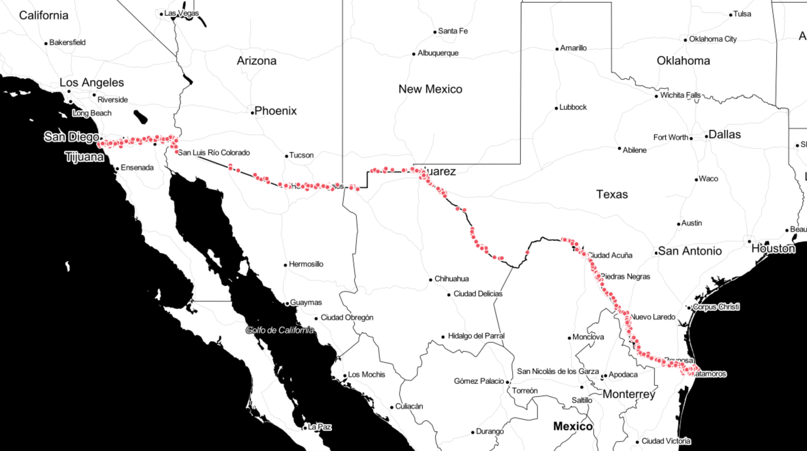
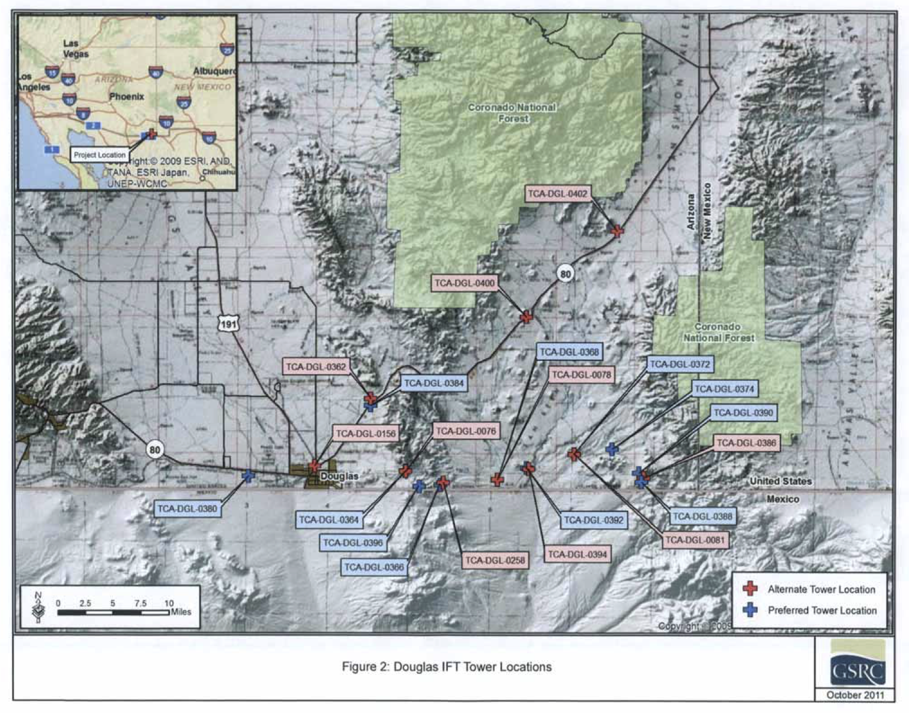
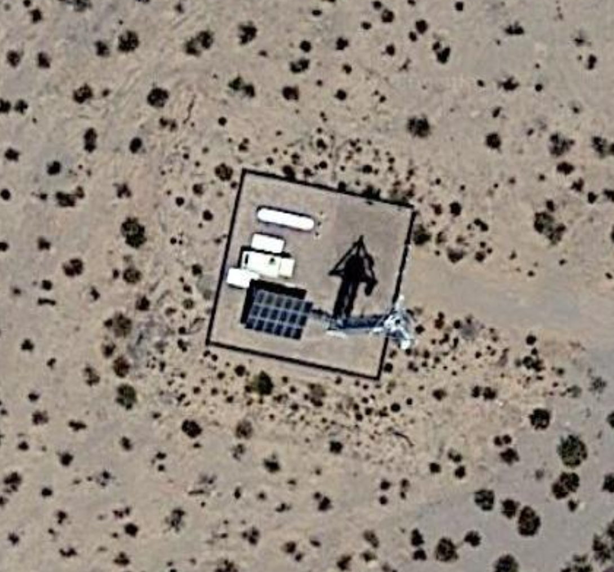
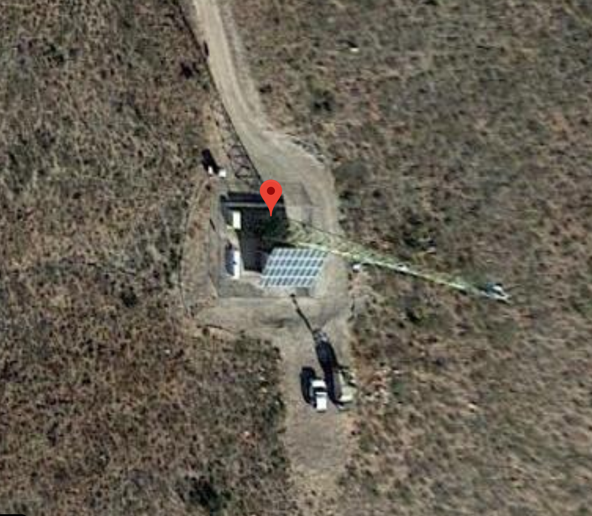
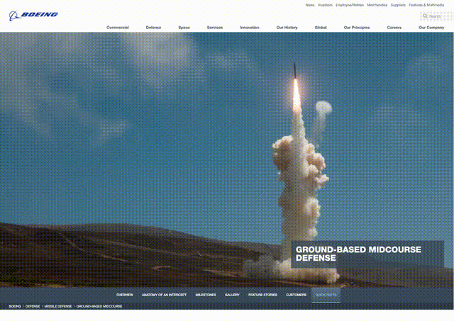
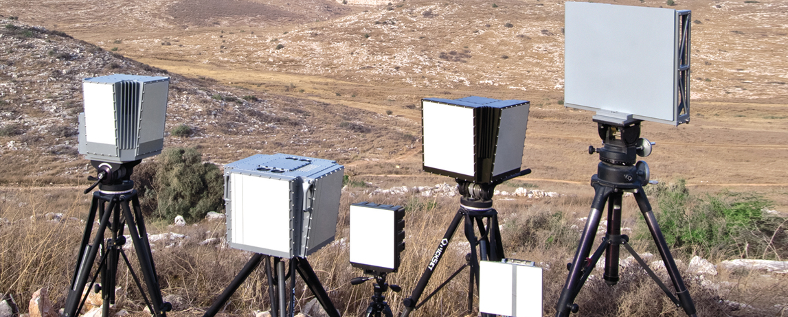

# Inside hundreds of surveillance experiments along the US-MX border

## Overview

Dozens of defense contractors are testing out new surveillance technologies along the US-Mexico border. By examining thousands of broadcast licenses filed with the Federal Communications Commission (FCC), the scale of this activity comes into view. 

This repository provides a guide for exploration. You can [examine the FCC License data yourself](#the-data), track [radio license activity on a map](#the-geography), or dive into the [specific defense companies](#index-of-companies-experimenting-along-border) that are prototyping new ground radar systems for detecting bodies and drones.

Borders are often spaces of exception that exist not only as [liminal areas between countries](https://www.reuters.com/article/us-usa-court-border/u-s-supreme-court-divided-on-mexican-cross-border-shooting-dispute-idUSKBN1XM2NG), but also as [liminal places in the law](https://theintercept.com/2019/06/22/cbp-border-searches-journalists/). They therefore warrant special attention and accountability.

## Background

While the Trump administration remains fixated on the construction of a physical wall along the 1,954 mile border between the US and Mexico, a crop of defense contractors and start-ups have been busy testing new generations of surveillance technologies. 

In 2019, [over 1000 applications](#summaries) were filed with the FCC for short-term experimental licenses to set up radio transmitters along the border. These are often meant to both detect movement around the border and to serve as communication systems in rugged terrains without access to wireless networks.

Some of the more spectacular of these involve the [flying of un-manned, high-altitude surveillance blimps](https://www.theguardian.com/us-news/2019/aug/02/pentagon-balloons-surveillance-midwest) that can record the movement of people and vehicles over a vast area.
 
However, most have a much more terrestrial footprint. There are a crop of companies coming out of Silicon Valley like Andreessen Horowitz-backed [SkySafe](https://www.skysafe.io/) ([video](https://player.vimeo.com/video/225631600)), which produces anti-drone technology (to combat [drug smuggling](https://qz.com/1058702/trumps-multibillion-dollar-border-wall-wouldnt-stop-this-5000-drone/)) and [Echodyne](https://echodyne.com/) ([video](https://www.youtube.com/watch?time_continue=2&v=OGy9sDNMm2Q)), a company backed by Bill Gates that produces [a new kind of radar](https://www.geekwire.com/2016/border-patrol-echodyne-drone-radar/) for tracking low flying drones. 

The majority of the applications come from defense contractors based in the US, Europe and Israel who are vying for billions in government contracts to build a virtual border wall. A complete list can be found [here](#index-of-companies-experimenting-along-border).

In the US so-called “virtual fences” have a checkered past. In 2011, after five years and more than $1 billion spent, the Department of Homeland Security cancelled its high-profile 'Secure Border Initiative' with Boeing after it proved to be a [total failure](http://www.nytimes.com/2011/01/15/us/politics/15fence.html). Since then a new program--the [Integrated Fixed Tower](https://theintercept.com/2019/08/25/border-patrol-israel-elbit-surveillance/) (IFT) system--has been [showing promise](https://www.cbp.gov/newsroom/national-media-release/integrated-fixed-towers-certified) using technology pioneered on the Israeli border, but big gaps remain in the agency’s goal of total surveillance. 

The fantasy of using sensor networks to patrol border areas dates back to the Vietnam War. [Operation Igloo White](https://en.wikipedia.org/wiki/Operation_Igloo_White), a brainchild of former Defense Secretary Robert McNamara, involved the installation of covert sensors along the Ho Chi Minh trail that would automatically dispatch bombing missions targeting the North Vietnamese. While technologically innovative for its time, the project is considered a failure--vast swaths of natural terrain have a way of escaping state control (cf ['The Closed World' by Paul Edwards](https://mitpress.mit.edu/books/closed-world) for a more complete discussion).

## The geography

[Explore map here](https://refractal.carto.com/builder/65b0ce36-31d2-470e-bd27-ecf9a709e377/embed)

The radio waves are busy place. The above map shows all of the radio transmitters that the FCC licenses anywhere within 10km of the border, both experimental and otherwise. Exploring the more remote areas may be of particular interest as patterns start to emerge in the placement and location of transmitters.

Even though radio waves are unseen, they are important sites of finance and politics (consider the [sale of spectrum](https://www.commlawmonitor.com/2017/04/articles/internet/fcc-announces-the-results-of-the-19-8-billion-broadcast-incentive-auction/) that's seen as essential for emerging 5G technologies).

The terrain is remote and inhospitable in places--leading to the death of thousands of migrants ([exacerbated by the systematic removal of watering stations](https://www.theguardian.com/us-news/2018/jan/17/us-border-patrol-sabotage-aid-migrants-mexico-arizona)) and stymying attempts to build surveillance networks, with the [vomit from buzzards](https://www.nytimes.com/2020/01/13/us/vulture-border-protection-tower.html) providing one difficulty among many.

[Source: [Report](./misc/ajo_cd_3.pdf)]

In addition to examining sites where radio transmitters are being deployed, the US Custom and Border Protection (CBP) is required to conduct [Environmental Assessments](https://www.cbp.gov/document/environmental-assessments) (EA) for its Office of Technology Innovation and Acquisition (OTIA) which provide detailed information about proposed deployments of surveillance towers along the border, as shown in the above image.

### Example sites
Every FCC radio license is accompanied by a latitude and longitude for the transmitter. Using either Google Maps, or the [historical image function](https://support.google.com/earth/answer/148094?hl=en) in Google Earth, makes the activity visible at different points in time.	

## The data

Radios are used in everything from cell phone towers, to radar systems, weather satellites, fast food drive-thrus, oil pipeline sensors, and much besides. 

In the US, every radio transmitter that operates above a certain power requires a license from the FCC. A comprehensive list of issued licenses is published [here](http://reboot.fcc.gov/license-view/) and can be loaded into a database and geocoded using this [tool](https://github.com/marcdacosta/spectrum-wrangler).

Of particular interest along the border are those licenses issued under the `Experimental License System (ELS)` which is for short-term deployments of new radio transmitters and which provides visibility into testing and R&D. 

Every transmitter has a `FRN` number associated with it--listed in the included summary files and in the metadata fields in the [map view](https://refractal.carto.com/builder/65b0ce36-31d2-470e-bd27-ecf9a709e377/embed)--which can be searched in the [FCC application database ](https://wireless2.fcc.gov/UlsApp/ApplicationSearch/searchAdvanced.jsp) online to find a wealth of supporting information. This often includes commentary--when not classified--about the purpose of the test so you can better understand what is happening in a particular site.
	

### Summaries
The following summary reports were generated in January 2020 using the FCC License database.

- [All Radio Licenses within 10km of border](./jan2020-exports/allradios-10km-border.csv)
- [Experimental Licenses within 25km of border](./jan2020-exports/experimental-25km-border.csv)
- [Experimental Licenses within 50km of border](./jan2020-exports/experimental-50km-border.csv)
- [All Defense Contractors operating within 25km of border](./jan2020-exports/USMX-Border-Experiment-Cos.csv)
- [All Radio Licenses for DRS Leonardo (nationwide)](./jan2020-exports/license-drs-all-us.csv) 
- [All Radio Licenses for Elbit Systems (dba ELTA North America) (nationwide)](./jan2020-exports/license-etla-na-all-us.csv)
- [All Radio Licenses for Imsar (nationwide)](./jan2020-exports/license-imsar-all-us.csv)

### DIY

If you are familiar with databases and would like to work with this data yourself:

1. Load FCC License database w [Spectrum Wrangler](https://github.com/marcdacosta/spectrum-wrangler)
2. Load the [US-Mexico border shapefile](./misc/usmx84.zip)
		`shp2pgsql -I usmx84/usmx84.shp usmx84 | psql -U 'username' -d 'fcc database name'`

3. Here’s a list of [helpful queries](./misc/postgres-notes.md)

## The companies
The following provides a summary of the defense companies that are active along the US-MX border.

### Listing of top companies for experimental license activity 2017-2019 within 50km of border

| Company                                     |  Licenses    | 
|--------------------------------------|-----| 
| TICOM GEOMATICS, INC.                | 640 | 
| Rockwell Collins, Inc.               | 232 | 
| L3Harris Technologies, Inc.          | 217 | 
| Raytheon Missile Systems             | 184 | 
| United Technologies Corporation      | 116 | 
| SkySafe, Inc.                        | 112 | 
| General Atomics                      | 91  | 
| Northrop Grumman Systems Corporation | 68  | 
| TrellisWare Technologies             | 54  | 
| The Boeing Company                   | 47  | 
| ELTA North America                   | 32  | 
| Fenix Group, Inc.                    | 30  | 
| DRS Sustainment Systems, Inc.        | 25  | 
| Lockheed Martin Corporation          | 22  | 
| BOOZ ALLEN HAMILTON                  | 16  |
| Other									| 169 | 
| **Total 2017-2019**                 | **2180**  | 

*Elbit Systems (ELTA), an Israeli defense contractor, Ground Radar Product Line*

### Index of companies experimenting along border
|Company                                    |Website                                                                         |
|-------------------------------------------|--------------------------------------------------------------------------------|
|The Boeing Company                         |[https://www.boeing.com/defense/missile-defense/ground-based-midcourse/index.page]()|
|Rockwell Collins, Inc.                     |[https://www.rockwellcollins.com/Products-and-Services/Defense/Targeting.aspx]()    |
|ELTA North America                         |[https://www.nextgenborder.com/ ]()                                                 |
|SkySafe, Inc.                              |[https://www.skysafe.io/ ]()                                                        |
|Leonardo DRS                               |[https://www.leonardodrs.com/]()                                                    |
|Northrop Grumman Systems Corporation       |[https://www.northropgrumman.com ]()                                                |
|Raytheon Missile Systems                   |[https://www.raytheon.com/capabilities/sensors]()                                   |
|Lockheed Martin Corporation                |[https://www.lockheedmartin.com/en-us/index.html ]()                                |
|Harris Corporation                         |[https://www.harris.com/what-we-do/strategic-tactical-and-maritime-satcom]()        |
|United Technologies Corporation            |[https://www.utc.com]()                                                             |
|BAE Systems                                |[https://www.baesystems.com/]()                     |
|Plextek Ltd                                |[https://www.plextek.com/]()                                                        |
|ReconRobotics, Inc.                        |[https://reconrobotics.com/]()                                                      |
|Fenix Group, Inc.                          |[https://fenixgroup.io/ ]()                                                         |
|TrellisWare Technologies                   |[https://www.trellisware.com/]()                                                    |
|SRC, Inc.                                  |[https://www.srcinc.com/ ]()                                                        |
|AeroVironment, Inc.                        |[https://www.avinc.com/ ]()                                                         |
|Mustang Technology Group, LP               |[https://www2.l3t.com/mustangtechnology/]()                                         |
|IMSAR LLC                                  |[https://www.imsar.com/]()                                                          |
|BOOZ ALLEN HAMILTON                        |[https://www.boozallen.com/markets/defense-and-intelligence.html]()                 |
|General Atomics Aeronautical Systems, Inc. |[http://www.ga-asi.com]()                                                           |
|Echodyne Corp.                             |[https://echodyne.com/]()                                                           |
|AKELA Inc.                                 |[https://akelainc.com/]()                                                           |
|Lociva                                     |[https://www.lociva.com/]()                                                         |
|Applied Research Associates, Inc           |[https://www.ara.com/]()                                                            |
|Fortem Technologies, Inc.                  |[https://fortemtech.com/]()                                                         |
|Ultra Electronics Advanced Tactical Systems|[https://www.ultra-electronics.com/ats]()                                           |
|Swarm Technologies, Inc.                   |[https://www.swarm.space/]()                                                        |
|GIRD Systems, Inc.                         |[https://www.girdsystems.com/]()                                                    |
|The MITRE Corporation                      |[https://www.mitre.org/]()                                                          |
|Alion Science and Technology               |[https://www.alionscience.com/]()                                                   |
|General Dynamics                           |[https://gdmissionsystems.com/command-and-control]()                                |
|NIITEK Inc.                                |[https://www.chemring.co.uk/what-we-do/sensors-and-information/counter-explosive-hazard/ied-detection]()|
|Oceus Networks Inc.                        |[https://www.oceusnetworks.com/xiphos-micro/]()                                     |
|SAIC                                       |[https://www.saic.com/]()                                                           |
|Thales Defense & Security Inc              |[https://www.thalesdsi.com/our-services/]()                                         |
|C Speed LLC                                |[http://www.cspeed.com/radar]()                                                     |
|Persistent Systems LLC                     |[https://www.persistentsystems.com/]()                                              |
|Applied Physical Sciences Corp.            |[https://www.aphysci.com/]()                                                        |
|Ball Aerospace                             |[https://www.ball.com/aerospace/markets-capabilities/markets/defense-intelligence/antenna-systems]()|
|IDS Ingegneria dei Sistemi SpA             |[https://www.idscorporation.com/]()                                                 |
|Silvus Technologies, Inc.                  |[https://silvustechnologies.com/applications/military/]()                           |
|TCOM, L.P.                                 |[https://tcomlp.com/aerostat-platforms/strategic-class-aerostat-systems-2/]()       |
|Teledyne Scientific Company                |[http://www.teledyne-si.com/products-and-services]()                                |
